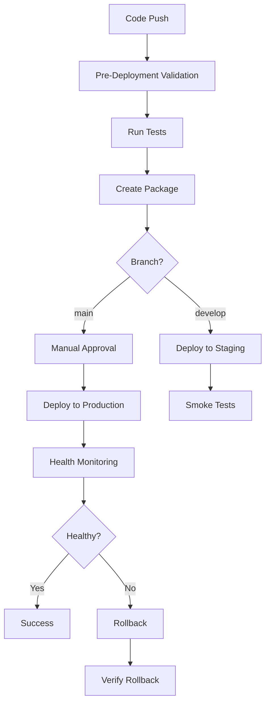
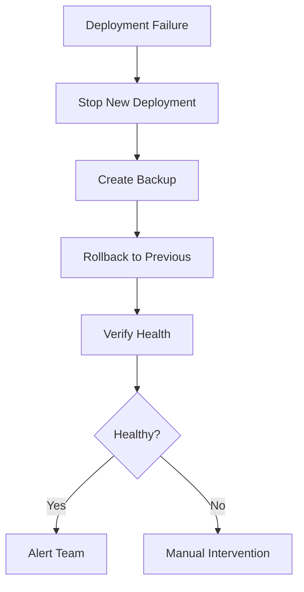

# EDMS CI/CD Integration Guide

**Version**: 1.0  
**Date**: December 24, 2024  
**Status**: Production Ready ✅

---

## 📋 Overview

Complete CI/CD integration guide for deploying EDMS with automated testing, validation, and rollback capabilities across multiple platforms.

### Supported Platforms
- ✅ GitHub Actions
- ✅ GitLab CI/CD
- ✅ Jenkins
- ✅ Docker-based (platform-agnostic)
- ✅ Any platform supporting bash scripts

---

## 🎯 Quick Start

### For GitHub Actions
```yaml
# Already configured in .github/workflows/deploy.yml
# Just push to main or develop branch
git push origin main
```

### For GitLab CI
```yaml
# Already configured in .gitlab-ci.yml
# Push or create merge request
git push origin develop
```

### For Jenkins
```groovy
# Already configured in Jenkinsfile
# Create pipeline job pointing to repository
```

### For Docker-based CI/CD
```bash
# Use universal pipeline script
./scripts/ci-pipeline.sh all
```

---

## 🚀 Platform-Specific Setup

## 1. GitHub Actions

### Files Created
- `.github/workflows/deploy.yml` - Main deployment workflow

### Setup Steps

1. **Add Repository Secrets**
   Go to Settings → Secrets and variables → Actions

   ```
   Required Secrets:
   - STAGING_SSH_KEY: SSH private key for staging
   - STAGING_HOST: Staging server hostname
   - STAGING_USER: SSH username for staging
   - PRODUCTION_SSH_KEY: SSH private key for production
   - PRODUCTION_HOST: Production server hostname
   - PRODUCTION_USER: SSH username for production
   ```

2. **Enable Workflows**
   - Go to Actions tab
   - Enable workflows if disabled

3. **Configure Environments**
   - Go to Settings → Environments
   - Create `staging` and `production` environments
   - Add protection rules for production (required reviewers)

### Workflow Triggers

| Trigger | Action |
|---------|--------|
| Push to `main` | Deploy to production (with approval) |
| Push to `develop` | Deploy to staging |
| Pull Request | Run tests only |
| Manual dispatch | Deploy to chosen environment |

### Features
- ✅ Automated testing (backend + frontend)
- ✅ Pre-deployment validation
- ✅ Post-deployment validation
- ✅ Health monitoring (5 minutes)
- ✅ Automatic rollback on failure
- ✅ Artifact storage (reports, packages)
- ✅ GitHub Releases creation
- ✅ Pull request comments

### Usage Example

```bash
# Trigger production deployment
git push origin main

# Trigger staging deployment
git push origin develop

# Manual deployment via GitHub UI
# Actions → Deploy → Run workflow → Select environment
```

---

## 2. GitLab CI/CD

### Files Created
- `.gitlab-ci.yml` - Complete CI/CD pipeline

### Setup Steps

1. **Add CI/CD Variables**
   Go to Settings → CI/CD → Variables

   ```
   Required Variables:
   - STAGING_SSH_KEY: SSH private key (protected, masked)
   - STAGING_HOST: Staging server hostname
   - STAGING_USER: SSH username
   - PRODUCTION_SSH_KEY: SSH private key (protected, masked)
   - PRODUCTION_HOST: Production server hostname
   - PRODUCTION_USER: SSH username
   ```

2. **Configure Environments**
   - Environments are auto-created from pipeline
   - Configure protection rules in Settings → CI/CD → Environments

3. **Enable Runners**
   - Shared runners are enabled by default
   - Or configure specific runners in Settings → CI/CD → Runners

### Pipeline Stages

1. **validate** - Pre-deployment checks
2. **test** - Backend and frontend tests
3. **package** - Create deployment package
4. **deploy-staging** - Deploy to staging (auto on develop)
5. **deploy-production** - Deploy to production (manual approval)
6. **monitor** - Post-deployment monitoring

### Features
- ✅ 6-stage pipeline
- ✅ Parallel testing (backend + frontend)
- ✅ Security scanning (safety, bandit)
- ✅ Code quality checks
- ✅ Automatic staging deployment
- ✅ Manual production approval
- ✅ Automatic rollback
- ✅ Scheduled daily health checks
- ✅ Artifact storage (30-90 days)

### Usage Example

```bash
# Deploy to staging
git push origin develop

# Deploy to production
git push origin main
# Then: Pipelines → Manual actions → deploy-production → Play

# Schedule daily health checks
# CI/CD → Schedules → New schedule → Target: main
```

---

## 3. Jenkins

### Files Created
- `Jenkinsfile` - Declarative pipeline

### Setup Steps

1. **Install Required Plugins**
   ```
   - Pipeline
   - Docker Pipeline
   - SSH Agent
   - Credentials Binding
   - Blue Ocean (optional)
   - Email Extension
   ```

2. **Add Credentials**
   Go to Manage Jenkins → Manage Credentials

   ```
   Required Credentials:
   - staging-ssh-key: SSH Username with private key
   - staging-host: Secret text
   - staging-user: Secret text
   - production-ssh-key: SSH Username with private key
   - production-host: Secret text
   - production-user: Secret text
   - github-token: Secret text (optional, for releases)
   ```

3. **Create Pipeline Job**
   - New Item → Pipeline
   - Pipeline definition: Pipeline script from SCM
   - SCM: Git
   - Repository URL: your-repo-url
   - Script Path: Jenkinsfile

4. **Configure Build Triggers**
   - GitHub webhook (for auto-build on push)
   - Poll SCM (alternative)
   - Parameterized build

### Pipeline Stages

1. **Checkout** - Get code from repository
2. **Pre-Deployment Validation** - Verify package
3. **Run Tests** - Parallel testing
4. **Create Deployment Package** - Build package
5. **Deploy to Staging** - Auto deployment to staging
6. **Staging Smoke Tests** - Verify staging
7. **Deploy to Production** - Manual approval required
8. **Post-Deployment Monitoring** - 5-minute monitoring

### Features
- ✅ Manual approval for production
- ✅ Parallel test execution
- ✅ Docker agent support
- ✅ Automatic rollback
- ✅ Email notifications
- ✅ Slack integration (optional)
- ✅ GitHub release creation
- ✅ Artifact archival
- ✅ Build log retention (30 days)

### Usage Example

```bash
# Trigger build manually
# Jenkins → Job → Build with Parameters

# Automatic build on push
# Configure GitHub webhook: http://jenkins-url/github-webhook/

# Production deployment
# Build → Deploy to Production stage → Approve
```

---

## 4. Docker-Based CI/CD (Universal)

### Files Created
- `docker-compose.ci.yml` - CI services
- `infrastructure/containers/Dockerfile.ci` - CI runner image
- `scripts/ci-pipeline.sh` - Universal pipeline script

### Setup

1. **Build CI Runner Image**
   ```bash
   docker-compose -f docker-compose.ci.yml build ci-runner
   ```

2. **Set Environment Variables**
   ```bash
   export DEPLOY_HOST=your-server.com
   export DEPLOY_USER=deploy-user
   export SSH_KEY=~/.ssh/id_rsa
   export DEPLOY_PATH=/opt/edms
   ```

3. **Run Pipeline**
   ```bash
   # Full pipeline
   ./scripts/ci-pipeline.sh all
   
   # Individual stages
   ./scripts/ci-pipeline.sh validate
   ./scripts/ci-pipeline.sh test
   ./scripts/ci-pipeline.sh package
   ./scripts/ci-pipeline.sh deploy
   ./scripts/ci-pipeline.sh monitor
   ```

### Features
- ✅ Platform-agnostic
- ✅ Works anywhere Docker runs
- ✅ Isolated test environment
- ✅ Reusable across CI platforms
- ✅ Local testing capability

### Usage Example

```bash
# Local testing
docker-compose -f docker-compose.ci.yml run --rm ci-runner \
  ./scripts/ci-pipeline.sh test

# Full deployment
export DEPLOY_HOST=staging.example.com
export DEPLOY_USER=deploy
./scripts/ci-pipeline.sh all

# In any CI platform
docker run -v $(pwd):/workspace edms-ci-runner:latest \
  /workspace/scripts/ci-pipeline.sh all
```

---

## 🔧 Configuration

### Environment Variables

All platforms use these common variables:

```bash
# Deployment targets
DEPLOY_HOST=server.example.com
DEPLOY_USER=deploy-user
DEPLOY_PATH=/opt/edms           # Optional, default: /opt

# SSH Configuration
SSH_KEY=/path/to/private/key    # Optional, uses default if not set
SSH_PORT=22                     # Optional, default: 22

# Application
BACKEND_URL=http://localhost:8000
FRONTEND_URL=http://localhost:3000

# Testing
RUN_TESTS=true
SKIP_VALIDATION=false
```

### SSH Key Setup

Generate deployment keys:
```bash
# Generate key pair
ssh-keygen -t ed25519 -C "ci-deployment" -f ~/.ssh/ci_deploy_key

# Add public key to server
ssh-copy-id -i ~/.ssh/ci_deploy_key.pub user@server.com

# Use private key in CI/CD
# - GitHub: Add to repository secrets
# - GitLab: Add to CI/CD variables (masked)
# - Jenkins: Add as SSH Username with private key credential
```

---

## 📊 Pipeline Workflows

### Standard Deployment Flow



### Rollback Flow



---

## 🎯 Best Practices

### 1. Environment Strategy

**Recommended Setup:**
```
Development → Staging → Production
```

- **Development**: Feature branches, auto-deploy on push
- **Staging**: Develop branch, matches production config
- **Production**: Main branch, manual approval required

### 2. Secret Management

**DO:**
- ✅ Use platform secret managers
- ✅ Rotate keys regularly
- ✅ Use different keys per environment
- ✅ Mark secrets as protected/masked

**DON'T:**
- ❌ Store secrets in code
- ❌ Use same key for all environments
- ❌ Commit `.env` files
- ❌ Share production keys

### 3. Testing Strategy

**Pre-Deployment:**
```bash
1. Unit tests (fast, run always)
2. Integration tests (medium, run on PR)
3. E2E tests (slow, run before deployment)
```

**Post-Deployment:**
```bash
1. Health checks (immediate)
2. Smoke tests (5 minutes)
3. Monitoring (continuous)
```

### 4. Approval Process

**Staging:**
- Auto-deploy on develop branch
- No approval required
- Use for QA testing

**Production:**
- Manual approval required
- Minimum 2 reviewers (recommended)
- Deployment window restrictions (optional)

### 5. Rollback Strategy

**Automatic Rollback Triggers:**
- Health check fails
- Post-deployment validation fails
- Critical errors in logs

**Manual Rollback:**
```bash
# Via CI/CD
# Trigger rollback job/stage

# Via SSH
ssh user@server
cd /opt/edms-current
./scripts/rollback.sh --previous --backup-first
```

---

## 🔍 Monitoring & Alerts

### Built-in Monitoring

All pipelines include:
- ✅ Pre-deployment validation
- ✅ Post-deployment validation
- ✅ 5-minute health monitoring
- ✅ Daily health checks (GitLab scheduled)

### Integration Options

**Slack Notifications:**
```yaml
# Add to your pipeline
- name: Notify Slack
  run: |
    curl -X POST $SLACK_WEBHOOK \
      -d '{"text":"Deployment successful!"}'
```

**Email Notifications:**
```groovy
// Jenkins (already configured)
emailext(
  subject: "Deployment Status",
  body: "...",
  to: '${DEFAULT_RECIPIENTS}'
)
```

**PagerDuty Integration:**
```bash
# On failure
curl -X POST https://events.pagerduty.com/v2/enqueue \
  -d '{"routing_key":"KEY","event_action":"trigger",...}'
```

---

## 📈 Metrics & Reports

### Generated Artifacts

All platforms generate and store:

| Artifact | Retention | Description |
|----------|-----------|-------------|
| Deployment Package | 30 days | `.tar.gz` file |
| Pre-Deploy Report | 30 days | Validation results |
| Post-Deploy Report | 90 days | Validation results |
| Health Report | 90 days | HTML health report |
| Test Results | 30 days | JUnit XML/Coverage |
| Build Logs | 30 days | Complete logs |

### Accessing Reports

**GitHub Actions:**
```
Repository → Actions → Workflow Run → Artifacts
```

**GitLab CI:**
```
Project → CI/CD → Pipelines → Job → Artifacts
```

**Jenkins:**
```
Job → Build #N → Artifacts
```

---

## 🆘 Troubleshooting

### Common Issues

**1. SSH Connection Fails**
```bash
# Check key format
ssh-keygen -y -f ~/.ssh/key > /dev/null

# Test connection
ssh -v -i ~/.ssh/key user@host

# Check key is added to server
cat ~/.ssh/authorized_keys  # on server
```

**2. Health Check Fails**
```bash
# Check services
docker compose ps

# Check logs
docker compose logs backend frontend

# Run health check manually
./scripts/health-check.sh --verbose
```

**3. Package Creation Fails**
```bash
# Check disk space
df -h

# Check permissions
ls -la scripts/

# Run manually
./scripts/create-production-package.sh
```

**4. Tests Fail in CI**
```bash
# Run tests locally
docker-compose -f docker-compose.ci.yml run ci-runner \
  ./scripts/ci-pipeline.sh test

# Check test database
docker-compose -f docker-compose.ci.yml up test-db
```

---

## 🔐 Security Checklist

### Pre-Deployment
- [ ] Secrets stored securely (not in code)
- [ ] SSH keys are protected and masked
- [ ] Different keys for staging/production
- [ ] Dependency security scan passed
- [ ] Code quality checks passed

### Deployment
- [ ] Manual approval for production
- [ ] Pre-deployment backup created
- [ ] Rollback plan documented
- [ ] Monitoring enabled

### Post-Deployment
- [ ] Health checks passed
- [ ] No security warnings in logs
- [ ] SSL certificates valid
- [ ] Firewall rules updated

---

## 📚 Additional Resources

### Documentation
- **AUTOMATION_SCRIPTS_GUIDE.md** - Complete automation guide
- **HEALTH_CHECK_TEST_RESULTS.md** - Health check testing
- **AUTOMATION_SCRIPTS_TEST_REPORT.md** - Script testing results
- **DEPLOYMENT_QUICK_REFERENCE.md** - Quick commands

### Example Workflows
- `.github/workflows/deploy.yml` - GitHub Actions
- `.gitlab-ci.yml` - GitLab CI
- `Jenkinsfile` - Jenkins Pipeline
- `scripts/ci-pipeline.sh` - Universal script

---

## 🎓 Usage Examples

### Scenario 1: First-Time Setup

```bash
# 1. Choose your platform (GitHub/GitLab/Jenkins)

# 2. Add secrets/credentials
# - SSH keys
# - Server hostnames
# - User accounts

# 3. Enable pipeline
# - GitHub: Enable Actions
# - GitLab: Enable CI/CD
# - Jenkins: Create pipeline job

# 4. Test with staging
git checkout -b develop
git push origin develop

# 5. Deploy to production
git checkout main
git merge develop
git push origin main
# Approve deployment in CI/CD interface
```

### Scenario 2: Hotfix Deployment

```bash
# 1. Create hotfix branch
git checkout -b hotfix/critical-bug main

# 2. Fix and commit
git commit -m "Fix critical bug"

# 3. Test locally
./scripts/pre-deploy-check.sh .
./scripts/health-check.sh

# 4. Merge and deploy
git checkout main
git merge hotfix/critical-bug
git push origin main

# 5. Monitor deployment
# CI/CD will:
# - Run tests
# - Create package
# - Deploy to production
# - Monitor for 5 minutes
# - Rollback if issues detected
```

### Scenario 3: Rollback Deployment

```bash
# If automated rollback didn't work:

# Via CI/CD:
# 1. Trigger rollback job/stage manually

# Via SSH:
ssh user@production-server
cd /opt/edms-current
./scripts/rollback.sh --list
./scripts/rollback.sh --to edms-production-YYYYMMDD-HHMMSS --backup-first
./scripts/health-check.sh --alert
```

---

## ✅ Verification

### Test Your CI/CD Setup

```bash
# 1. Local validation
./scripts/pre-deploy-check.sh .

# 2. Create test package
./scripts/create-production-package.sh

# 3. Test deployment (staging)
git push origin develop

# 4. Monitor pipeline
# - Check all stages pass
# - Verify artifacts are created
# - Review health reports

# 5. Test rollback (staging)
ssh user@staging
cd /opt/edms-production-*
./scripts/rollback.sh --list
./scripts/rollback.sh --previous --dry-run
```

---

## 🎉 Success Criteria

Your CI/CD is ready when:
- ✅ Pipelines run automatically on push
- ✅ Tests pass in CI environment
- ✅ Staging deploys automatically
- ✅ Production requires approval
- ✅ Health checks pass post-deployment
- ✅ Rollback works when tested
- ✅ Reports are generated and stored
- ✅ Notifications work (if configured)

---

**Guide Version**: 1.0  
**Last Updated**: December 24, 2024  
**Status**: Production Ready ✅  
**Platforms Supported**: 4 (GitHub, GitLab, Jenkins, Docker)
