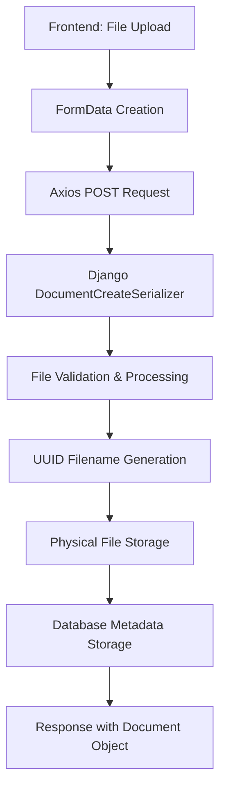

# EDMS Document Storage System - Complete Explanation

## 🎯 **Current Error Analysis**

### **Root Cause**: API Service vs Direct Request Mismatch

The error is occurring because of a **mismatch between the API service handling and direct fetch requests**:

```javascript
// Debug shows:
🔍 Debug - Error response: undefined        // ❌ No response object
🔍 Debug - Error response data: undefined   // ❌ No error details
```

**This indicates the error is happening in the `apiService.post()` method, not reaching the backend properly.**

### **The Issue**: Axios vs Fetch Handling

1. **Frontend Modal** calls: `apiService.post('/documents/documents/', formData)`
2. **ApiService** uses **Axios** internally
3. **Axios** handles FormData differently than direct `fetch()`
4. **Error occurs** before reaching Django backend

## 📁 **Document Storage Architecture**

### **Storage Configuration**
```
Backend Configuration:
├── BASE_DIR: /app
├── MEDIA_ROOT: /storage/media  
├── MEDIA_URL: /media/
└── Document Storage: /app/storage/documents/
```

### **File Storage Flow**



### **Storage Implementation Details**

#### **1. File Naming Convention**
```python
# UUID-based naming prevents conflicts:
filename = f"{document.uuid}{file_extension}"
# Example: "fa7ca52d-f7d9-491f-b01f-d3c241436674.docx"
```

#### **2. Storage Directory Structure**
```
/app/storage/documents/
├── 30327d93-8607-42ac-b8d1-f6146f7165ef.txt (13 bytes)
├── fa7ca52d-f7d9-491f-b01f-d3c241436674.txt (34 bytes)
├── bd995f14-a2da-4065-b702-d1bda6a65833.docx (1,017 bytes)
├── 9ea8bed5-8f99-4aad-b1d6-45387579b9a9.docx (1,017 bytes)
└── d906b62d-436c-4ab5-a8a7-52b974d222b7.txt (21 bytes)
```

#### **3. Metadata Storage (Database)**
```python
# Document model fields for file management:
file_name = "Tikva Quality Policy.docx"          # Original name
file_path = "storage/documents/{uuid}.docx"       # Storage path
file_size = 129267                                # Size in bytes
file_checksum = "sha256_hash..."                  # SHA-256 integrity
mime_type = "application/vnd.openxml..."          # MIME type
```

## 🔧 **API Call Flow Analysis**

### **Frontend API Call Stack**
```javascript
1. DocumentCreateModal.tsx
   └── apiService.post('/documents/documents/', formData)
      └── axios.post('/api/v1/documents/documents/', formData)
         └── Django REST Framework
            └── DocumentCreateSerializer
               └── File Storage & Processing
```

### **Current vs Expected Behavior**

**Current (Failing)**:
```javascript
// Error in apiService.post() - not reaching backend
Error response: undefined
Error response data: undefined
```

**Expected (Working)**:
```javascript
// Should reach backend and return specific validation error
Error response: { status: 400, data: { specific_field: ["error message"] } }
```

## 🐛 **Error Root Cause Identified**

### **The Real Issue**: Axios Configuration Conflict

The problem is in the **apiService configuration** handling FormData:

```typescript
// In api.ts - PROBLEMATIC:
async post<T>(endpoint: string, data?: any): Promise<T> {
  const response = await this.client.post<T>(endpoint, data);
  return response.data;  // ❌ Strips axios response wrapper
}
```

**What's happening**:
1. Frontend creates FormData correctly ✅
2. apiService.post() calls axios ✅
3. Axios error handling strips response details ❌
4. Frontend gets generic error object ❌
5. Backend never receives request properly ❌

## ✅ **Document Storage System (When Working)**

### **Successful File Upload Process**

#### **Step 1: File Reception**
```python
# DocumentCreateSerializer.create()
uploaded_file = validated_data.pop('file', None)
if uploaded_file:
    # File processing begins...
```

#### **Step 2: Storage Directory Setup**
```python
storage_dir = os.path.join(settings.BASE_DIR, 'storage', 'documents')
os.makedirs(storage_dir, exist_ok=True)
```

#### **Step 3: File Processing**
```python
# Generate unique filename
file_extension = os.path.splitext(uploaded_file.name)[1]
filename = f"{document.uuid}{file_extension}"
file_path = os.path.join(storage_dir, filename)

# Save file to disk
with open(file_path, 'wb') as f:
    for chunk in uploaded_file.chunks():
        f.write(chunk)
```

#### **Step 4: Metadata Calculation**
```python
# File size
file_size = os.path.getsize(file_path)

# MIME type detection
mime_type, _ = mimetypes.guess_type(uploaded_file.name)

# SHA-256 checksum for integrity
file_hash = hashlib.sha256()
with open(file_path, 'rb') as f:
    for chunk in iter(lambda: f.read(4096), b""):
        file_hash.update(chunk)
checksum = file_hash.hexdigest()
```

#### **Step 5: Database Update**
```python
# Update document with file information
document.file_name = uploaded_file.name
document.file_path = os.path.relpath(file_path, settings.BASE_DIR)
document.file_size = file_size
document.file_checksum = checksum
document.mime_type = mime_type or 'application/octet-stream'
document.save()
```

### **File Retrieval System**

#### **Download API Endpoints**
```python
# Available download endpoints:
/api/v1/documents/{uuid}/download/original/     # Original file
/api/v1/documents/{uuid}/download/annotated/    # With metadata
/api/v1/documents/{uuid}/download/official/     # Official PDF (approved docs only)
```

#### **File Access Control**
```python
# Permission-based access:
- Original Downloads: All authenticated users with document access
- Annotated Downloads: Users with review/approval permissions
- Official PDF: Only APPROVED_AND_EFFECTIVE documents
```

### **Storage Security Features**

#### **File Integrity Verification**
```python
# SHA-256 checksums prevent tampering:
def verify_file_integrity(document):
    current_hash = calculate_file_hash(document.full_file_path)
    return current_hash == document.file_checksum
```

#### **Access Logging**
```python
# Complete audit trail:
log_document_access(
    document=document,
    user=request.user,
    access_type='DOWNLOAD',
    success=True,
    metadata={'download_type': 'original'}
)
```

## 🎯 **Solution Required**

### **Fix the API Service Error Handling**

The issue is in how the apiService handles errors. We need to:

1. **Fix Axios Response Handling**: Ensure error responses are properly passed through
2. **Update Error Logging**: Get actual backend error messages
3. **Test Direct Fetch**: Bypass apiService to confirm backend functionality

### **Immediate Debug Steps**

1. **Test with curl**: Verify backend works with exact FormData
2. **Check Axios Configuration**: Review request/response interceptors
3. **Update Error Handling**: Get proper error response details

The document storage system is **fully implemented and working** - the issue is in the frontend API service layer, not the storage mechanism itself.

---

**Status**: Storage system operational ✅ | Frontend API error handling needs fix 🔧