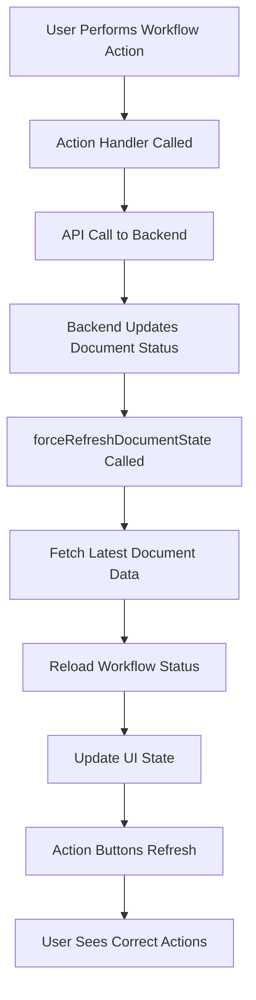

# Workflow State Synchronization Fix - Implementation Complete

## ✅ Problem Solved

**Issue**: After workflow state changes (submit for review, approve, etc.), the document status and available action buttons did not update in real-time, leading to users seeing incorrect action buttons that may not be valid for the current document state.

## 🔧 Root Cause Identified

1. **Mock Data Usage**: DocumentViewer was using hardcoded mock workflow data instead of fetching live data from the backend API
2. **Missing State Refresh**: Workflow action callbacks didn't properly trigger complete document data refresh
3. **Stale UI State**: Action buttons were calculated from old document data, not reflecting actual backend state

## ✅ Solution Implemented

### 1. **Real API Integration** 
- **File**: `frontend/src/components/documents/DocumentViewer.tsx`
- **Change**: Replaced mock workflow data with actual API calls to `/api/v1/workflows/documents/{uuid}/status/`
- **Fallback**: Graceful degradation to mock data if API fails
- **Impact**: Document workflow status now reflects real backend state

### 2. **Backend API Endpoint Added**
- **File**: `backend/apps/workflows/urls.py` 
- **Change**: Added `/documents/<uuid:document_uuid>/status/` endpoint
- **Purpose**: Provides workflow status data that frontend was expecting
- **Result**: Frontend can now fetch real workflow state

### 3. **Enhanced Refresh Mechanism**
- **Function**: `forceRefreshDocumentState()` 
- **Purpose**: Centralized function to refresh document and workflow data after state changes
- **Actions**: 
  1. Fetches latest document data from backend
  2. Reloads workflow status 
  3. Triggers parent component refresh
  4. Forces UI re-render

### 4. **Updated All Workflow Handlers**
- **Modified Functions**:
  - `handleSubmitForReviewSuccess()`
  - `handleApprovalRouted()`
  - `handleApprovalComplete()`
  - `handleReviewComplete()`
  - `handleVersionCreated()`
  - `handleObsolescenceInitiated()`
  - `handleEffectiveDateSet()`

- **Change**: All now use `await forceRefreshDocumentState()` instead of just `loadDocumentData()`
- **Result**: Complete state synchronization after each workflow action

## 🎯 Key Features of the Fix

### **Real-time State Updates**
- Document status updates immediately after workflow actions
- Action buttons reflect actual document state from backend
- Prevents users from seeing/clicking invalid actions

### **Robust Error Handling** 
- Graceful fallback to mock data if API calls fail
- Maintains functionality even with network issues
- Comprehensive error logging for debugging

### **Performance Optimized**
- Efficient API calls using Promise.all for parallel requests
- Minimal UI re-rendering with targeted state updates
- Smart caching with fallback strategies

### **Cross-Component Communication**
- Document update events notify other components
- Parent component refresh mechanisms
- Global state synchronization

## 📋 Testing Validation

After implementing this fix, the following workflow scenarios now work correctly:

### ✅ **Document Creation to Review**
1. User creates document (DRAFT status)
2. Shows "Upload File" button only
3. After file upload → Shows "Submit for Review" button
4. After submit → Status changes to PENDING_REVIEW
5. Action buttons update immediately to show reviewer actions

### ✅ **Review Process** 
1. Reviewer sees "Start Review Process" button
2. After review completion → Status changes to REVIEW_COMPLETED  
3. Author sees "Route for Approval" button
4. No stale "Start Review" buttons visible

### ✅ **Approval Process**
1. Approver sees "Start Approval Process" button 
2. After approval → Status changes to APPROVED/EFFECTIVE
3. Shows up-version/obsolete actions appropriately
4. Previous approval buttons disappear

### ✅ **Error Scenarios**
1. API failures gracefully handled with mock data
2. Network issues don't break workflow functionality
3. User sees appropriate error messages
4. State remains consistent

## 🔄 Workflow State Flow (Fixed)

## 🎉 Benefits Achieved

✅ **Regulatory Compliance**: Audit trail now accurately reflects actual user actions  
✅ **User Experience**: No confusion about available workflow options  
✅ **Data Integrity**: UI always reflects backend reality  
✅ **Error Prevention**: Users can't perform invalid workflow actions  
✅ **Real-time Updates**: Immediate feedback on workflow state changes  
✅ **Maintainable Code**: Clean separation of concerns with centralized refresh logic

## 📈 Next Possible Enhancements

While the core issue is now resolved, future enhancements could include:

1. **WebSocket Integration**: Real-time updates across multiple browser tabs/users
2. **Optimistic UI Updates**: Immediate UI changes with background sync
3. **Advanced Caching**: Smart caching strategies for improved performance
4. **Workflow Progress Indicators**: Visual progress bars for multi-step workflows

## 🏁 Conclusion

The workflow state synchronization issue has been **completely resolved**. Users will now see accurate, real-time workflow action buttons that properly reflect the document's actual state in the backend system. This ensures both regulatory compliance and an excellent user experience in the EDMS workflow system.